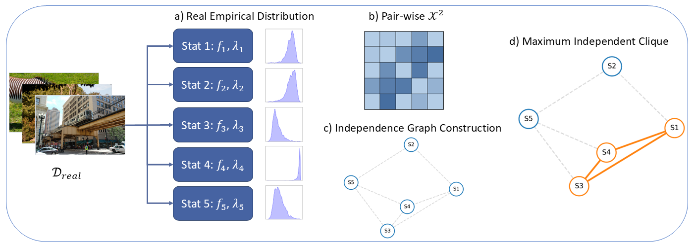
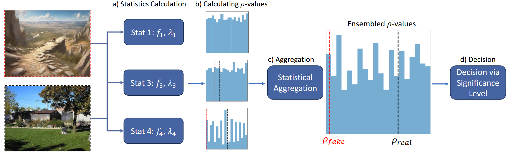

# RealStats: Real-Only Statistical Framework for Fake Image Detection (AISTATS 2026 Spotlight)

Authors: [Haim Zisman](https://www.linkedin.com/in/haim-zisman/), [Uri Shaham](https://www.linkedin.com/in/urishaham/)

>As generative models continue to evolve, detecting AI-generated images remains a critical challenge. Although effective detection methods exist, they often lack formal interpretability and may rely on implicit assumptions about fake content, potentially limiting their robustness to distributional shifts.
In this work, we introduce a rigorous, statistically grounded framework for fake-image detection that produces a probability score interpretable with respect to the real-image population. Our method leverages the strengths of multiple existing detectors by combining strong training-free statistics. We compute p-values over a range of test statistics and aggregate them using classical statistical ensembling to assess alignment with a unified real-image distribution.
This framework is generic, flexible, and training-free, making it well suited for robust fake-image detection across diverse and evolving settings.

<div align="center">

<a href="https://">
  
</a> 
<a href="https://arxiv.org/">
  
</a>

<br>

<em>Rigorous statistics • Adaptable detector design • Interpretable p-values</em>

</div>

## Overview
Modern fake-image detectors often rely on synthetic training data.  
RealStats instead computes a statistically grounded probability by evaluating each image against a reference distribution derived only from real imagery.

**Core goals**

- **Interpretability:** outputs are calibrated *p*-values with clear statistical meaning.  
- **Adaptability:** detectors rely only on real-image distributions, allowing quick integration of new statistics - Any scalar detector that can be computed on real imagery can be plugged in, ECDF-modeled, and aggregated.

These choices follow the design detailed in our paper.

---

## Architecture at a Glance
**Two-phase workflow**
1. **Null distribution modeling:** compute statistics on real images, fit empirical CDFs, and select an independence-respecting subset.  

2. **Inference:** reuse the cached ECDFs to map each new image into per-statistic *p*-values and aggregate them (Stouffer or min-*p*).

---

### Null Distribution Modeling Phase
<p align="center">
  
</p>

This phase estimates the empirical cumulative distribution functions (ECDFs) for each statistic on real data, forming the foundation for the interpretability of RealStats.

---

### Inference Phase
<p align="center">
  
</p>

During inference, each image is evaluated against the modeled ECDFs, producing per-statistic *p*-values that are combined into a unified decision metric.

---

## Installation  
Tested with **Python 3.10**.

```bash
# Using venv
python -m venv .venv
source .venv/bin/activate
pip install -r requirements.txt

# Using Conda
conda create -n realstats python=3.10 -y
conda activate realstats
pip install -r requirements.txt
```

GPU acceleration is recommended, as the detectors rely on large vision encoders.

---

## Datasets
RealStats expects CSV manifest files enumerating both real and synthetic images.  


### Default layout
```
RealStats/
└── data/
    └── RealStatsDataset/
        ├── reference_real_paths.csv
        ├── test_real_paths.csv
        └── test_fake_paths.csv
```
Each CSV has the columns `dataset_name` and `path`, allowing the loader to stitch relative paths into absolute locations.

### Selecting generators
- Use the `DatasetType` enum to target a single generator family or evaluate across all benchmarks.  
- Fake images are filtered per-generator at runtime so you can mix datasets without changing the CSVs.

For custom datasets, create additional CSVs (or add generators) and point the `DatasetType` entry to the appropriate directory.

### References and Links
Below are the sources for the datasets used in our evaluation:

**Real-image datasets**
- **LSUN, FFHQ, ImageNet** - https://github.com/grip-unina/ClipBased-SyntheticImageDetection/tree/main/data    
- **MS-COCO (2017, Train Val and Test)** - https://cocodataset.org/#download
- **LAION** - https://github.com/WisconsinAIVision/UniversalFakeDetect

**Synthetic / generative datasets**
- **CNNSpot** (Wang et al. 2020) - https://github.com/peterwang512/CNNDetection  
- **Universal Fake Detect - diffusion_datasets** (Ojha et al. 2023) - https://github.com/WisconsinAIVision/UniversalFakeDetect
- **GenImage** (Zhu et al. 2023) - https://github.com/GenImage-Dataset/GenImage  
- **Synthbuster** (Bammey 2024) + **LDM** (Cozzolino 23) - https://github.com/grip-unina/ClipBased-SyntheticImageDetection/tree/main/data  
- **Stable Diffusion Face Dataset** - https://github.com/tobecwb/stable-diffusion-face-dataset  


These links provide the original sources for the datasets referenced in the RealStats paper.

---

## Running the Pipeline

The main entry point is [`pipeline.py`](pipeline.py), which handles both null-distribution modeling and inference:

```bash
python pipeline.py \
    --batch_size 32 \
    --sample_size 512 \
    --threshold 0.05 \
    --num_samples_per_class -1 \
    --num_data_workers 3 \
    --max_workers 3 \
    --gpu "0" \
    --statistics RIGID.DINO.05 RIGID.DINO.10 RIGID.DINOV3.VITS16.05 RIGID.DINOV3.VITS16.10 RIGID.CLIPOPENAI.05 RIGID.CLIPOPENAI.10 RIGID.CONVNEXT.05 RIGID.CONVNEXT.10 \
    --ensemble_test minp \
    --patch_divisors 0 \
    --chi2_bins 15 \
    --dataset_type ALL \
    --pkls_dir pkls/ \
    --cdf_bins 400 \
    --ks_pvalue_abs_threshold 0.45 \
    --cremer_v_threshold 0.07 \
    --preferred_statistics RIGID.DINO.05 RIGID.CLIPOPENAI.05 RIGID.DINO.10 RIGID.CLIPOPENAI.10
```

You can also simply run the hard-coded script: `scripts/run_pipeline_hardcoded.sh`

For inference only: `scripts/run_inference_hardcoded.sh`

**Tips**
- Use `CUDA_VISIBLE_DEVICES` (or the `--gpu` flag) to pin the job to specific GPUs.  
- Statistics are cached as `.npy` files per image in the `pkls_dir` so subsequent runs reuse precomputed histograms.  
- MLflow logs AUC/AP, ROC curves, and intermediate artifacts to `outputs/` by default.

---

## Key Components
| Module | Purpose |
|--------|---------|
| [`statistics_factory.py`](statistics_factory.py) | Registry of statistic backbones (DINO, CLIP, BEiT, ConvNeXt, etc.) and their perturbation levels. |
| [`stat_test.py`](stat_test.py) | Core testing logic: statistic preprocessing, ECDF construction, independence graph building, and ensemble aggregation. |
| [`processing/`](processing) | Concrete implementations for RIGID-style perturbation statistics and manifold curvature features. |
| [`datasets_factory.py`](datasets_factory.py) | Dataset wiring and generator-specific splits. |
| [`data_utils.py`](data_utils.py) | Dataset primitives, JPEG corruption transforms, and patch extraction utilities. |
| [`pipeline.py`](pipeline.py) | Reproducible CLI runner with MLflow logging, seed control, and evaluation helpers. |

---

## Reproducing Paper Results
1. **Prepare real-only reference sets** using the provided CSV manifests (or your own) so ECDFs are fit without synthetic leakage. The `reproducibility/` directory includes the original splits used in the paper, together with the raw scores from the ManifoldBias method evaluated on this data.

2. **Calibrate statistics** by running the pipeline once per dataset configuration. This builds the cache of real statistics in `pkls/`.  
3. **Evaluate generators** with `--ensemble_test minp` (paper default) or `--ensemble_test stouffer` for robustness to distributed evidence.  


For the full 180K-image benchmark reported in the manuscript, iterate over the provided `DatasetType` entries (CNNSpot, Universal Fake Detect, GenImage, SynthBuster, Stable Diffusion Faces) and aggregate metrics.

---

## Extending RealStats
Want to plug in a new statistic? Follow these steps:

1. **Implement the detector** under `processing/`, exposing a `preprocess(images)` method that returns per-image scalars.  
2. **Register it** in [`statistics_factory.py`](statistics_factory.py) with a descriptive key (e.g., `MYNEWSTAT.05`).  
3. **Recalibrate ECDFs** by rerunning `pipeline.py` so the new statistic is cached on the reference dataset.  
4. **Update preferred statistics** via `--preferred_statistics` if you want the clique selection to favor your detector during independence pruning.

---

## 📚 BibTeX
```bibtex
@inproceedings{zisman2026realstats,
  title     = {RealStats: A Real-Only Statistical Framework for Fake Image Detection},
  author    = {Zisman, Haim and Shaham, Uri},
  booktitle = {Proceedings of the International Conference on Artificial Intelligence and Statistics (AISTATS)},
  year      = {2026},
  url       = {https://github.com/shaham-lab/RealStats}
}
```

---

## 📄 License
This repository is released for research purposes only.  
Please consult the paper’s supplementary material for dataset licensing details, and ensure compliance with the original dataset terms when reproducing results.

For questions or collaboration requests, feel free to open an issue.

---

<p align="center">Made with ❤️ for interpretable, reliable fake-image detection.</p>
